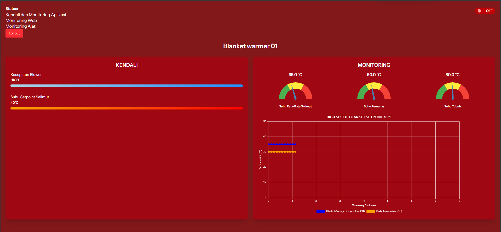

# Blanket IoT Web Dashboard

A web-based IoT dashboard for controlling and monitoring a **Blanket Warmer Machine**.  
Built using **Laravel + Inertia.js + React (with Vite)**, and integrated with **Firebase** for authentication and realtime monitoring.  

----

## ✨ Features
- 🔐 **Login system** (email & password via Firebase Authentication)  
- 🖥️ **Dashboard** with:
  - Control blower speed (Low / Medium / High)  
  - Set blanket temperature setpoint  
  - Monitor blanket average temperature  
  - Monitor heater temperature  
  - Monitor body temperature  
- 📊 **Realtime chart** from Firebase Realtime Database  

----

## 📸 Preview
  

----

## 🚀 Tech Stack
- **Laravel 10** (backend + Inertia middleware)  
- **React** (frontend components, rendered via Inertia)  
- **Vite** (bundler for React inside Laravel)  
- **Firebase** (Authentication + Realtime Database)  

----

## 🛠️ Installation & Setup

### 1. Clone the repository
````bash
git clone https://github.com/your-username/blanket-iot-web.git
cd blanket-iot-web
````

### 2. Install PHP dependencies (Laravel)
````bash
composer install
cp .env.example .env
php artisan key:generate
````

### 3. Install JS dependencies (React + Vite)
````bash
npm install
````

### 4. Configure Firebase
In .env add your Firebase credentials
````bash
VITE_FIREBASE_API_KEY=xxxxxx
VITE_FIREBASE_AUTH_DOMAIN=xxxxxx
VITE_FIREBASE_DATABASE_URL=xxxxxx
VITE_FIREBASE_PROJECT_ID=xxxxxx
VITE_FIREBASE_STORAGE_BUCKET=xxxxxx
VITE_FIREBASE_MESSAGING_SENDER_ID=xxxxxx
VITE_FIREBASE_APP_ID=xxxxxx
VITE_FIREBASE_MEASUREMENT_ID=xxxxxx
````
### 5. Run the project
````bash
composer run dev
````

Laravel with Inertia will automatically render the React components.

## 📌 Notes

Login credentials are hardcoded in Firebase Authentication (for demo/testing).

For production:
- Use secure Firebase rules.
- Implement proper role-based authentication in Laravel if needed.
- Laravel can also be extended to log device activity or serve REST APIs in addition to Inertia views.
